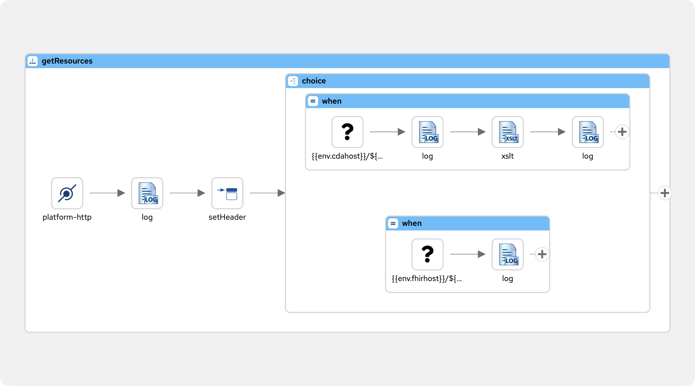
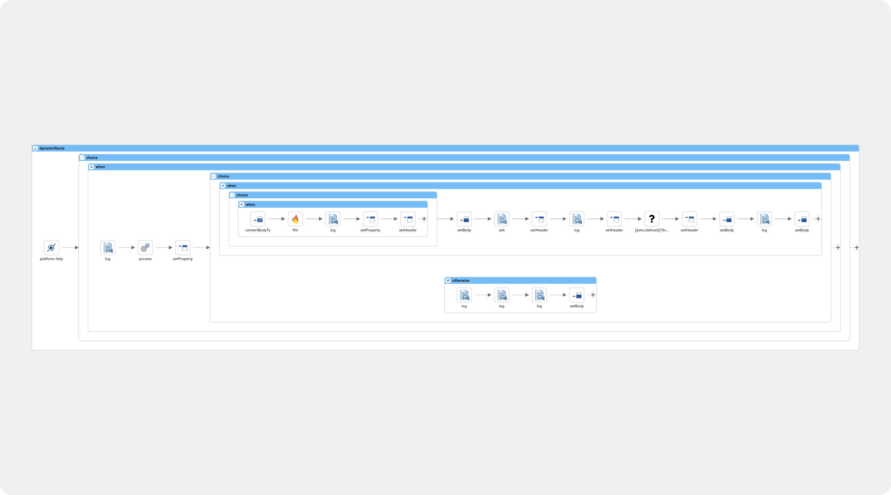

# Healthcare Integration Routes

This project contains Camel routes that handle the transformation and integration between FHIR (Fast Healthcare Interoperability Resources) and CDA (Clinical Document Architecture) formats.

## Route Descriptions

### 1. QueryFHIRfromCDA Route
**Endpoint:** `/queryFHIRfromCDA/{object}/{id}`

This route enables bi-directional querying between FHIR and CDA systems:
- Accepts GET requests with object type and ID parameters
- Can retrieve data from either CDA or FHIR systems based on the `X-get-from` header
- Performs automatic format conversion using XSLT transformations
- Supports both CDA-to-FHIR and FHIR-to-CDA transformations
- Useful for retrieving patient records, observations, or other clinical documents




### 2. Dynamic Route
**Endpoint:** `/dynamicRoute`

This route handles the processing and synchronization of healthcare documents:
- Accepts POST requests with healthcare documents
- Performs validation of incoming FHIR resources
- Features:
  - Bi-directional transformation between FHIR and CDA formats
  - Optional FHIR server storage (controlled by `toFHIR` header)
  - Automatic CDA storage
  - Validation status tracking
  - Comprehensive error handling and logging



## Environment Variables Required

- `env.cdahost`: URL of the CDA server
- `env.fhirhost`: URL of the FHIR server
- `env.xslhost`: Location of XSLT transformation files
- `env.fhirVersion`: FHIR version to use for server communication

## Headers

Important headers used by the routes:
- `X-get-from`: Specifies source system ('cda' or 'fhir')
- `toFHIR`: Flag to indicate if FHIR storage is needed ('Y')
- `validation-passed`: Validation status flag
- `fhir-resource`: Type of FHIR resource being processed

## Route States

The routes track various states through headers:
- `message_transformed`: Indicates successful format transformation
- `message_stored_cda`: Confirms CDA storage
- `fhir_updated`: Confirms FHIR server update

## How to run and build in dev
Runnning for dev
```bash
mvn org.springframework.boot:spring-boot-maven-plugin:run
```

Starting FHIR server
```
podman run -p 8090:8080 hapiproject/hapi:latest
```

Building and running
```bash
# Build
mvn clean install
# Run
java -jar target/fhir-to-cda-tester-1.0.0-SNAPSHOT.jar --env.xslhost="http://10.215.66.15:5500/api/xsl?name=" --env.fhirhost="http://10.215.66.15:8090/fhir" --env.cdahost="http://10.215.66.15:5500/cda_system"

```

## some testing from cli - does not require FHIR backend
```bash
 curl -X POST -d '@src/main/resources/inputs/fhir.xml' -H "Content-Type: application/xml" http://localhost:8080/dynamicRoute 

 curl -X POST -d '@src/main/resources/inputs/valid-observation.json' -H "Content-Type: application/json" http://localhost:8080/dynamicRoute 


  curl -X POST -d '@src/main/resources/inputs/valid-patient.json' -H "Content-Type: application/json" http://localhost:8080/dynamicRoute 

  curl -X POST -d '@src/main/resources/inputs/invalid-observation.json' -H "Content-Type: application/json" http://localhost:8080/dynamicRoute 

```

If testing with FHIR add property in URI: toFHIR=Y


```bash
podman build . -t f2c-demo-camel
podman run --rm --name f2c-demo-camel -p 8080:8080 -e env_xslhost="http://xslhost:5000/api/xsl?name=" -e env_fhirhost="http://fhirhost:8090/fhir" -e env_cdahost="http://10.215.66.15:5500/cda_system" f2c-demo-camel
```

Building to push to x86 repo
```bash
podman build . -t f2c-demo-camel --platform linux/amd64
```

### Monitoring
Hawtio enable
http://[ip]:8080/actuator/hawtio


java -jar target/fhir-to-cda-tester-1.0.0-SNAPSHOT.jar --env.xslhost="http://10.215.66.15:5500/api/xsl?name=" --env.fhirhost="http://10.215.66.15:8090/fhir" --env.cdahost="http://10.215.66.15:5500/cda_system"